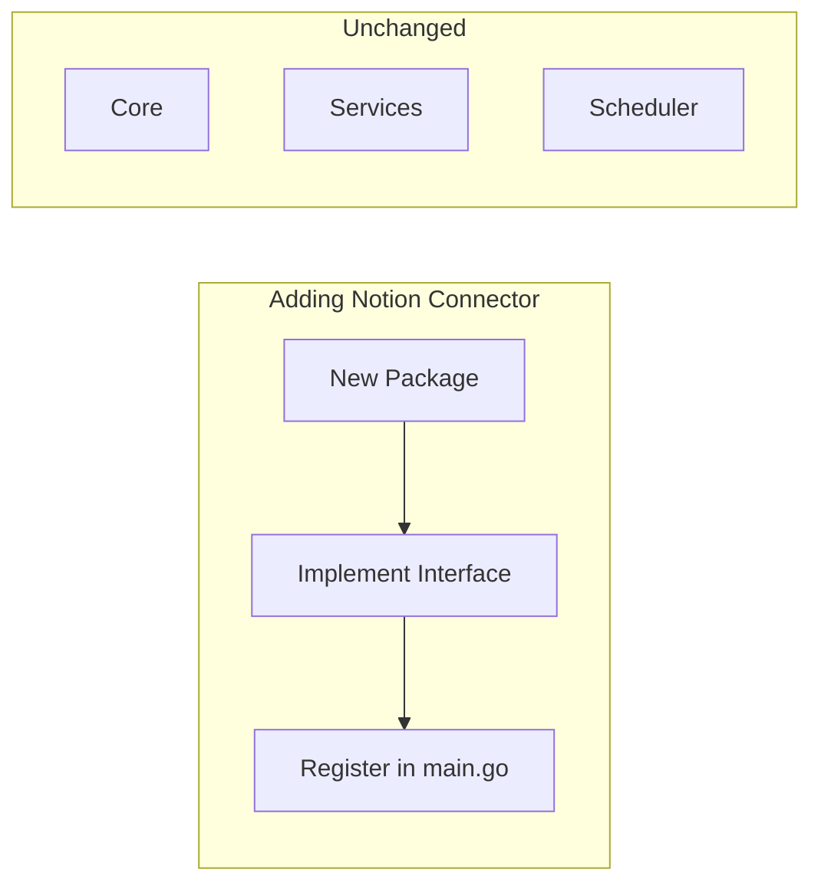
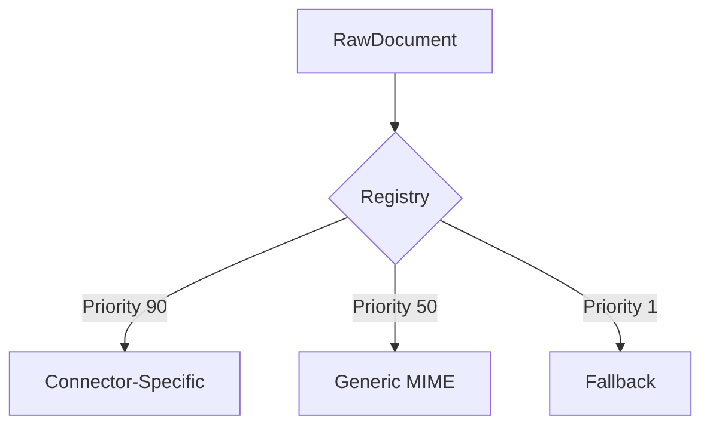
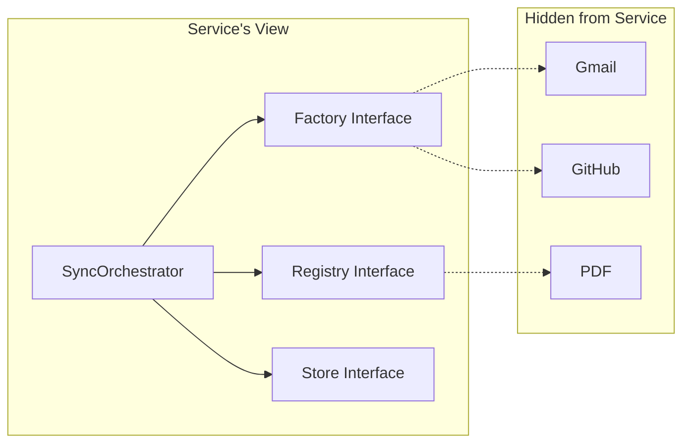
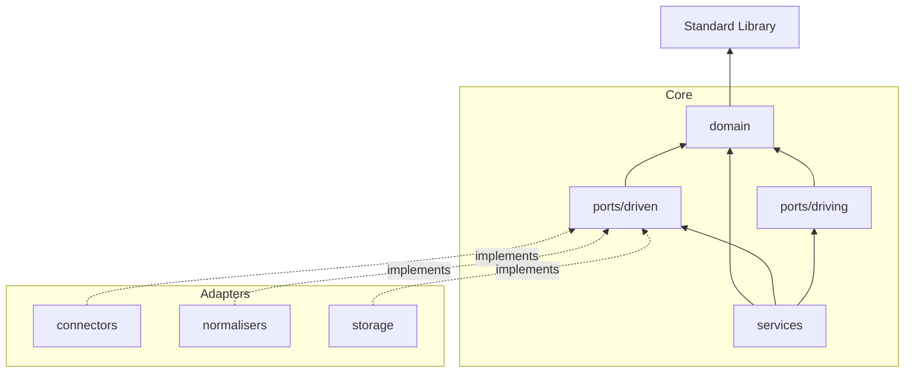

# Architectural Constraints

:::danger Hard Rules
These constraints are **hard rules**. Breaking them is considered a design error. They protect the core from coupling and ensure Sercha remains extensible, testable, and maintainable for years to come.
:::

## Constraint A: Connectors Are Plugin-Like

| Rule | Enforcement |
|------|-------------|
| Adding a connector requires zero changes to core | Implements interface only |
| Connectors live in isolated packages | `internal/connectors/<name>/` |
| Single registration point | One line in `main.go` |
| Services never check connector type | Use factory abstraction |
| Multiple instances per type | Factory creates from config |

## Constraint B: Normalisers Are Plugin-Like

| Rule | Enforcement |
|------|-------------|
| New MIME types require zero core changes | Implements interface only |
| Generic normalisers in `normalisers/` | PDF, HTML, Markdown |
| Connector-specific in connector package | Gmail emails, Slack messages |
| Selection via registry | MIME type + priority |
| Services never check MIME type | Registry handles dispatch |

## Constraint C: Services Are 100% Generic

Services (including SyncOrchestrator and Scheduler) must be completely agnostic to what they process.

| Allowed | Forbidden |
|---------|-----------|
| `factory.Create(source)` | `if source.Type == "gmail"` |
| `connector.Fetch()` | `switch connector.(type)` |
| `registry.Normalise(raw)` | `if raw.MIME == "pdf"` |
| `store.Save(doc)` | Type assertions |

## Constraint D: Core Remains Pure

The `core/` package has no knowledge of implementations.

| Package | May Import | Must NOT Import |
|---------|------------|-----------------|
| `core/domain` | Standard library | Any internal package |
| `core/ports/driven` | `core/domain` | Any adapter |
| `core/ports/driving` | `core/domain` | Any adapter |
| `core/services` | `core/domain`, `core/ports` | Any adapter |

**Dependencies point inward.** Adapters depend on ports. Core depends on nothing external.

## Audit Checklist

| Requirement | Verification |
|-------------|--------------|
| Connectors are plugin-like | Zero core changes for new connector |
| Multiple instances per type | Factory creates from config |
| Normalisers are plugin-like | Zero core changes for new format |
| Normaliser priority works | Connector-specific > MIME > fallback |
| Services are generic | No type checks, no adapter imports |
| Core is pure | No adapter imports in core/ |
| Scheduler uses driven port | SQLite adapter for task persistence |
| Single wiring point | All registration in main.go |
| Boundaries enforced | Directory structure matches |
| Driving adapters don't import core/services | Use driving ports only |

## Enforcement

| Method | Purpose |
|--------|---------|
| **Code review** | Check against audit list |
| **Import linting** | CI rejects forbidden imports |
| **Architecture tests** | Verify dependency direction |
| **This document** | Source of truth |

## Next

- [Architecture Overview](./overview) - Why hexagonal architecture
- [Extensibility](./extensibility) - How to add new components correctly
