# Data Flow

This page documents the complete journey of data through Sercha, from source to searchable index.

## Overview

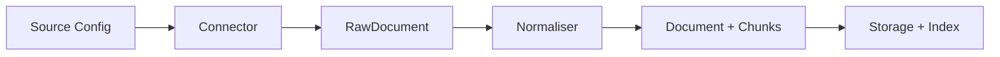

## Sync Flow

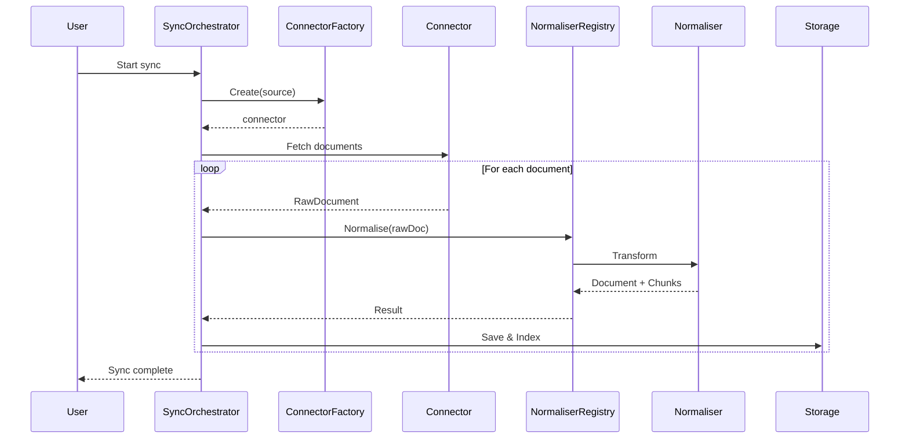

### What Services Do NOT Do

SyncOrchestrator (and other services) are intentionally generic. They delegate all specifics to adapters:

| Services Never... | Instead... |
|-------------------|------------|
| Detect MIME types | Registry handles dispatch |
| Branch on connector type | Factory creates appropriate connector |
| Do file I/O | Connectors handle fetching |
| Make HTTP calls | Connectors handle networking |
| Parse file formats | Normalisers handle transformation |

This keeps services testable and ensures new connectors/normalisers work without service changes.

## Data Transformations

### Stage 1: Source to RawDocument

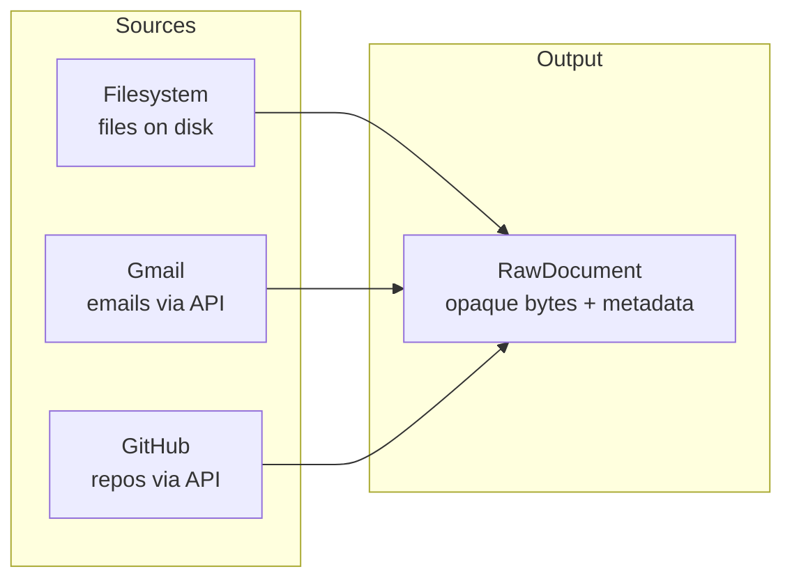

The connector's job: Fetch raw content, produce uniform `RawDocument` stream.

### Stage 2: RawDocument to Document + Chunks

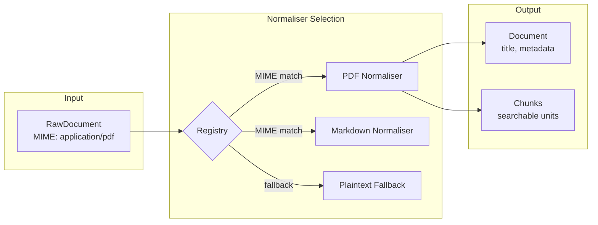

The normaliser's job: Extract text, split into chunks, preserve metadata.

### Stage 3: Chunks to Storage

Chunks are always stored in SQLite (metadata) and Xapian (full-text). Vector storage only happens when an embedding service is configured.

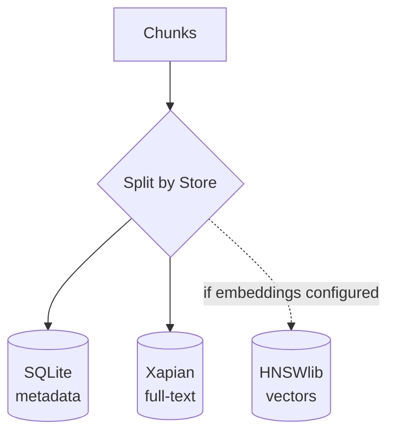

## Search Flow

Keyword search via Xapian is always available. Semantic search via HNSWlib is only used when embeddings are configured.

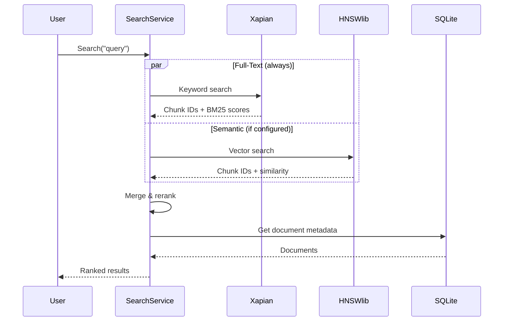

Without embeddings, only the Xapian path runs (pure keyword search).

## Sync Models

Sercha supports two sync models based on connector capabilities:

### Pull-Based Sync

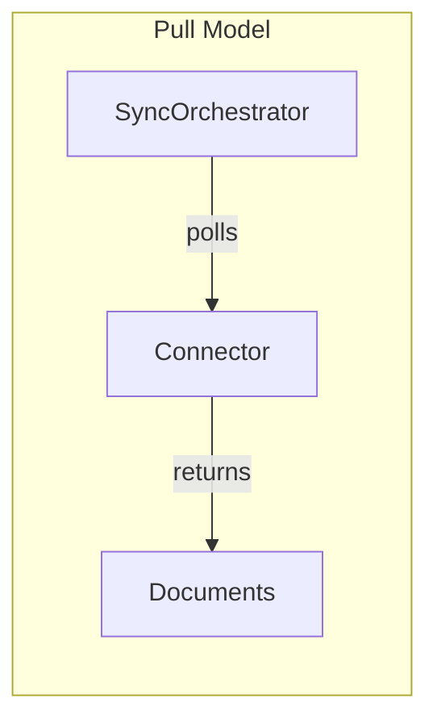

**Used by:** Gmail (API polling), GitHub (API), Notion, most cloud services

**How it works:**
1. SyncOrchestrator requests documents from connector
2. Connector fetches via API
3. SyncOrchestrator processes results
4. Repeat on schedule (via Scheduler)

### Push-Based Sync (Watch)

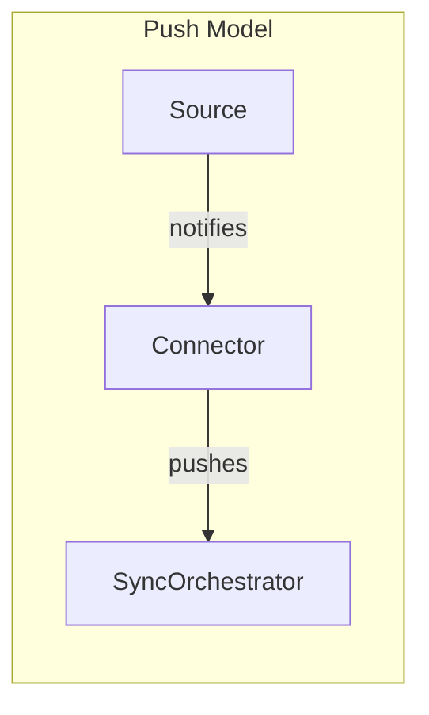

**Used by:** Filesystem (FSNotify), Slack (Events API), webhooks

**How it works:**
1. Connector registers for events
2. Source notifies of changes
3. Connector pushes to SyncOrchestrator
4. SyncOrchestrator processes immediately

### Capability-Driven Selection

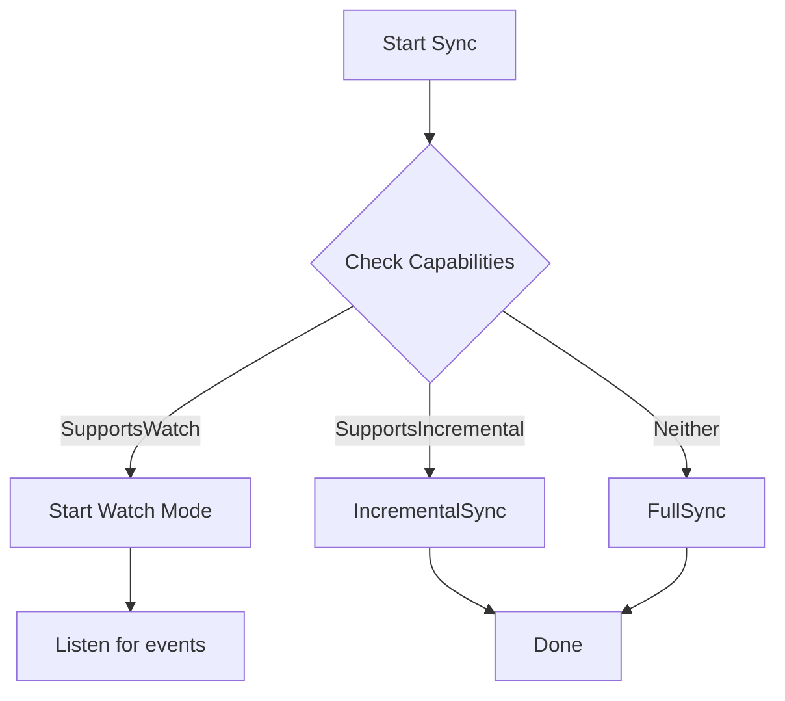

SyncOrchestrator automatically chooses the best strategy based on what the connector supports.

## Incremental Sync

For sources that support it, Sercha tracks sync state to fetch only changes:

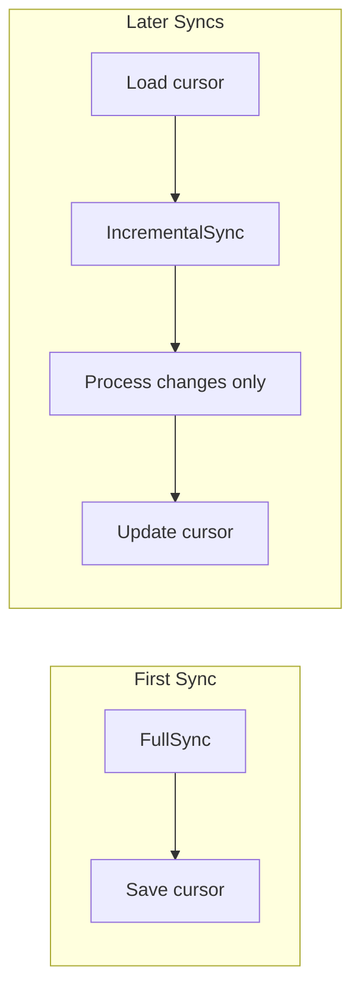

## Background Tasks (Scheduler)

The Scheduler runs periodic background tasks. Unlike SyncOrchestrator which is request-driven, the Scheduler operates autonomously on configurable intervals.

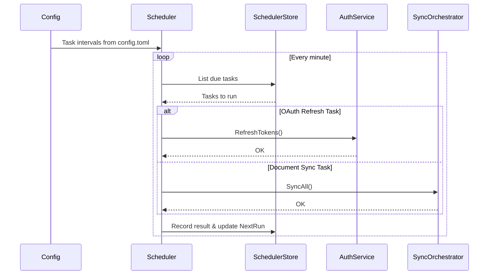

### Scheduled Tasks

| Task ID | Purpose | Default Interval |
|---------|---------|------------------|
| `oauth_refresh` | Refresh OAuth tokens before expiry | 30 minutes |
| `document_sync` | Sync all configured sources | 60 minutes |

### Configuration

Tasks are configured in `~/.sercha/config.toml`:

```toml
[scheduler.oauth_refresh]
enabled = true
interval = "30m"

[scheduler.document_sync]
enabled = true
interval = "1h"
```

### Architecture Compliance

The Scheduler follows hexagonal architecture:
- **Domain entities:** `ScheduledTask`, `TaskResult`, `SchedulerConfig` in `core/domain`
- **Driven port:** `SchedulerStore` in `core/ports/driven`
- **Service:** `Scheduler` in `core/services`
- **SQLite adapter:** Implements `SchedulerStore` with task persistence

## Next

- [Storage Layer](./storage-layer) - How data is stored
- [Extensibility](./extensibility) - Adding new connectors/normalisers
