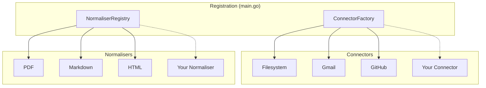
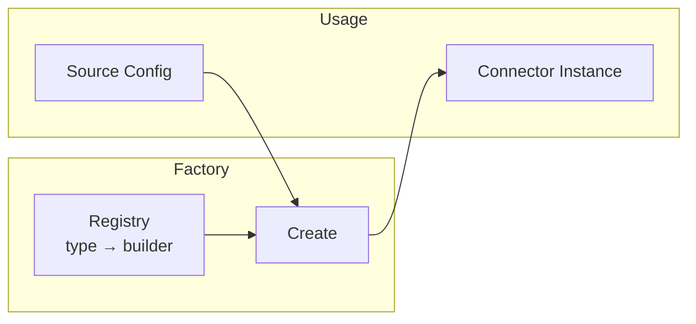
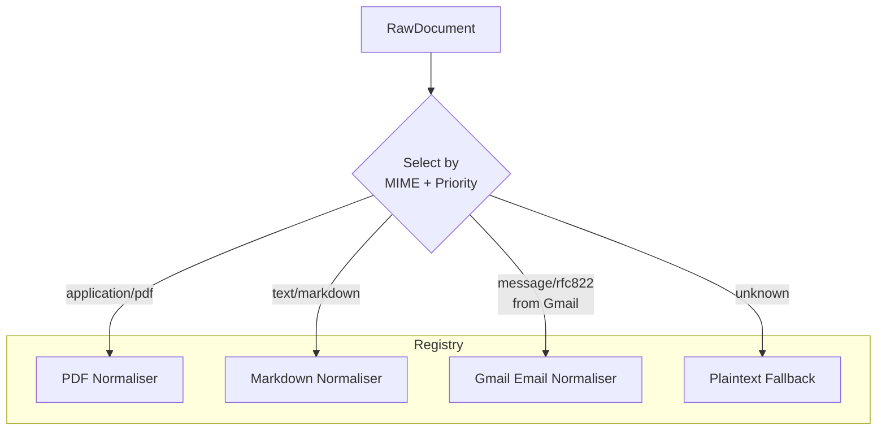
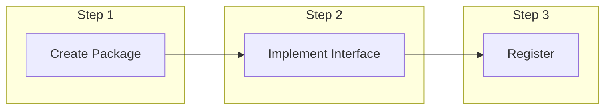
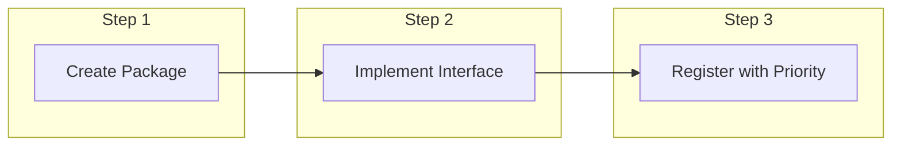
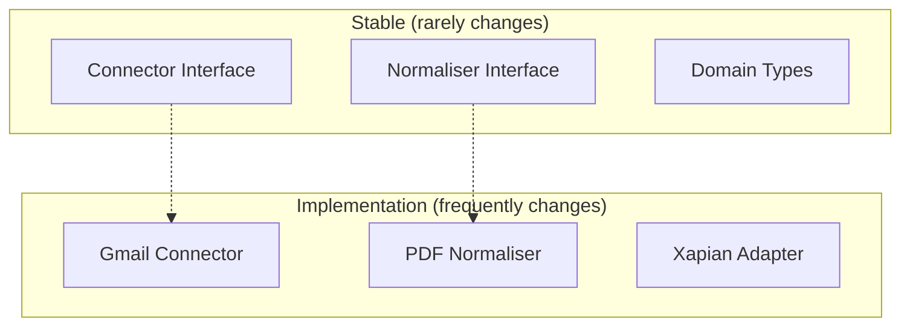
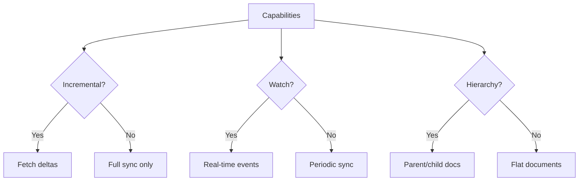
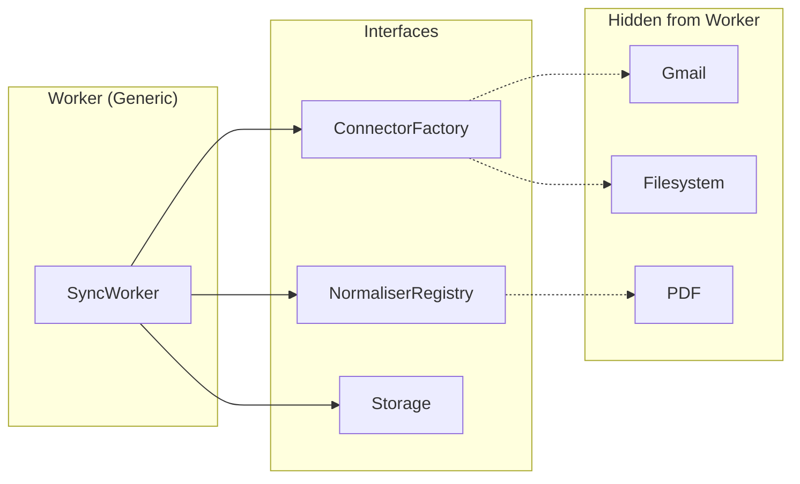
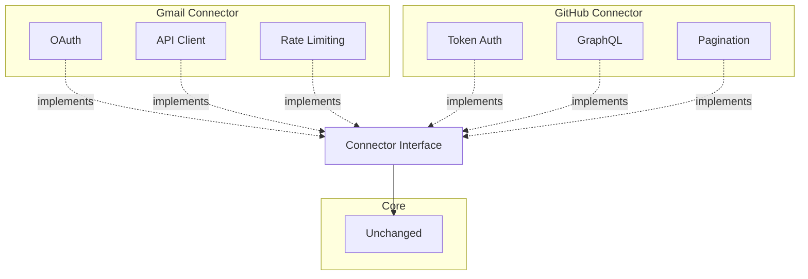

# Extensibility

Sercha is designed for maximum extensibility with minimum coupling. This page explains the extension mechanisms.

## Extension Points

## The Factory Pattern

### ConnectorFactory

**How it works:**
1. Each connector registers a builder function
2. Factory stores `type → builder` mapping
3. When source config arrives, factory looks up type
4. Builder creates configured instance

**Zero coupling:** Factory doesn't import connector packages directly. Registration happens at startup.

### NormaliserRegistry

**Priority System:**

| Priority | Type | Example |
|----------|------|---------|
| 90-100 | Connector-specific | Gmail email normaliser |
| 50-89 | Format-specific | PDF, Markdown |
| 10-49 | Generic | HTML, plaintext |
| 1-9 | Fallback | Raw text extraction |

## Adding a Connector

**What you create:**
- One package under `connectors/`
- Implements `Connector` interface

**What you touch:**
- One line in `main.go` for registration

**What you DON'T touch:**
- Core domain
- Services
- Workers
- Other connectors

### Connector Checklist

- [ ] Create package under `connectors/<name>/`
- [ ] Implement `NewConnector(source Source) (Connector, error)`
- [ ] Implement `FullSync(ctx) (<-chan RawDocument, <-chan error)`
- [ ] Implement `Capabilities()` returning supported features
- [ ] Register in `main.go`: `factory.Register("<name>", <name>.NewConnector)`
- [ ] Add tests in `connector_test.go`

## Adding a Normaliser

**Normaliser Types:**

| Type | Location | Priority | Use Case |
|------|----------|----------|----------|
| Generic MIME | `normalisers/pdf/` | 50-89 | PDF from any source |
| Connector-specific | `connectors/gmail/` | 90-100 | Gmail email format |
| Fallback | `normalisers/plaintext/` | 1-9 | Unknown formats |

### Normaliser Checklist

- [ ] Create package under `normalisers/<mime>/` (or in connector package)
- [ ] Implement `SupportedMIMETypes() []string`
- [ ] Implement `Priority() int` (see table above)
- [ ] Implement `Normalise(ctx, RawDocument) (*NormaliseResult, error)`
- [ ] Register in `main.go`: `registry.Register(<name>.NewNormaliser())`
- [ ] Add tests in `normaliser_test.go`

## Interface Stability

**Stability guarantees:**
- Interfaces change only for major versions
- Implementations can change anytime
- Core domain is most stable

## Capability System

Connectors declare what they support:

**Capability flags:**

| Capability | Meaning | Examples |
|------------|---------|----------|
| SupportsIncremental | Can fetch only changes | Gmail, GitHub |
| SupportsWatch | Can push real-time events | Filesystem, Slack |
| SupportsHierarchy | Has nested structure | Drive, GitHub repos |
| SupportsBinary | Handles binary content | All |

## Worker Abstraction

**Workers never:**
- Check connector type
- Check MIME type
- Import connector packages
- Import normaliser packages

**Workers only:**
- Call factory to create connectors
- Call registry to normalise
- Call storage to persist

## Extension Isolation

**Bug isolation:** A bug in Gmail connector cannot affect:
- GitHub connector
- Core services
- Search functionality
- Other users' data

## Next

- [Constraints](./constraints) - Architectural rules
- [Data Flow](./data-flow) - How data moves through the system
