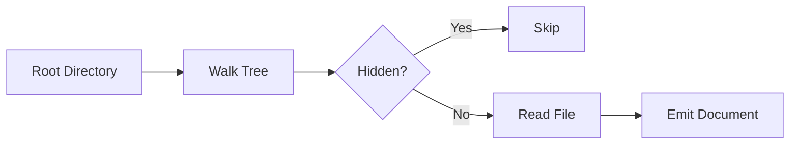
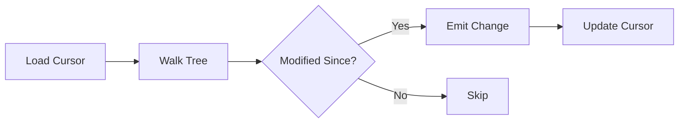
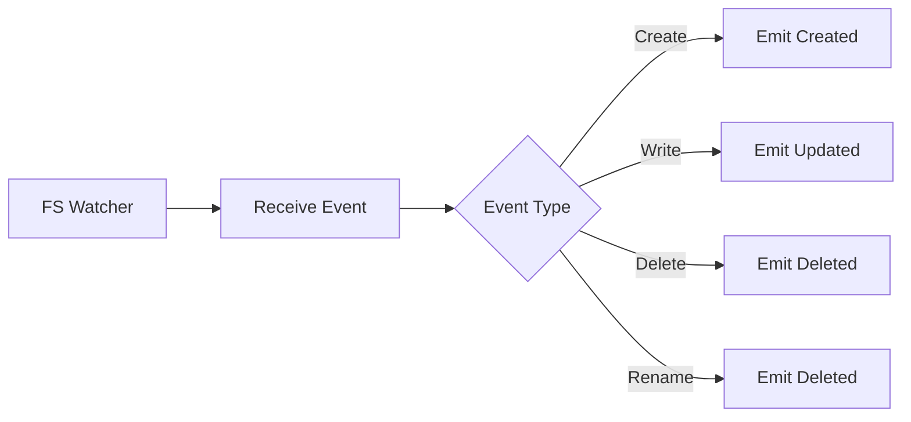

# Filesystem Connector

The filesystem connector indexes files from local directories. It recursively walks a directory tree and produces documents for each file encountered.

## Capabilities

| Capability | Supported | Notes |
|------------|-----------|-------|
| Full sync | Yes | Walks entire directory tree |
| Incremental sync | Yes | Uses modification timestamps as cursor |
| Watch mode | Yes | Real-time updates via filesystem notifications |
| Hierarchy | Yes | Preserves directory structure via parent URIs |
| Binary content | No | Text files only |
| Validation | Yes | Verifies root path exists and is readable |

## Authentication

The filesystem connector requires no authentication. It operates with the permissions of the user running Sercha.

## Configuration

Configuration is specified when creating a source:

| Option | Description | Required |
|--------|-------------|----------|
| `path` | Absolute path to the directory to index | Yes |

The path must be an absolute path to an existing directory. Relative paths are not supported.

## File Discovery

The connector recursively walks the configured directory, indexing all files it encounters.

### Hidden Files

Files and directories beginning with a dot are excluded from indexing. This includes:

- Hidden configuration files (`.gitignore`, `.env`)
- Hidden directories (`.git`, `.vscode`)
- System files (`.DS_Store`)

### Symbolic Links

Symbolic links are followed during directory traversal. Be aware that this can lead to infinite loops if symlinks create cycles. The connector does not detect symlink cycles.

### Unreadable Files

Files that cannot be read (due to permissions or other errors) are skipped silently. The sync continues with remaining files.

## Document Structure

### URI Pattern

Documents are identified by their absolute file path:

| Component | Value |
|-----------|-------|
| URI | Absolute path to the file |
| Example | `/home/user/projects/api/src/main.go` |

### Parent Hierarchy

The connector preserves directory hierarchy through parent URIs. Each file's parent URI points to its containing directory, except for files directly in the root path.

| File Path | Parent URI |
|-----------|------------|
| `/root/src/main.go` | `/root/src` |
| `/root/readme.md` | `nil` (if `/root` is the configured path) |

### MIME Type Detection

The connector determines MIME types from file extensions. Programming language files receive accurate MIME types:

| Extension | MIME Type |
|-----------|-----------|
| `.go` | `text/x-go` |
| `.py` | `text/x-python` |
| `.rs` | `text/x-rust` |
| `.ts` | `text/typescript` |
| `.tsx` | `text/typescript-jsx` |
| `.jsx` | `text/javascript-jsx` |
| `.md` | `text/markdown` |
| `.yaml`, `.yml` | `text/yaml` |
| `.toml` | `text/toml` |
| `.sh`, `.bash` | `text/x-shellscript` |
| `.sql` | `text/x-sql` |

For other extensions, the system MIME type database is consulted. Unknown extensions default to `application/octet-stream`.

### Metadata

Each document includes the following metadata:

| Field | Description |
|-------|-------------|
| `filename` | Base name of the file |
| `extension` | File extension without the leading dot |
| `size` | File size in bytes |
| `modified` | Last modification time (RFC3339 format) |
| `modified_unix` | Last modification time (Unix timestamp) |

## Sync Behaviour

### Full Sync

Full sync walks the entire directory tree, producing a document for each file. The sync completes when all files have been processed.

### Incremental Sync

Incremental sync uses a timestamp cursor to identify files modified since the last sync. Only files with a modification time after the cursor are included.

The cursor format is a Unix timestamp in nanoseconds, providing millisecond precision for change detection.

### Watch Mode

Watch mode uses filesystem notifications to detect changes in real time. When a file is created, modified, or deleted, the connector emits a change event immediately.

The watcher monitors all directories recursively. When a new directory is created, it is automatically added to the watch list.

#### Event Types

| Filesystem Event | Change Type |
|------------------|-------------|
| File created | Created |
| File modified | Updated |
| File deleted | Deleted |
| File renamed | Deleted (old path) |

Renamed files appear as a deletion of the old path. If the new path is within the watched directory, a separate creation event follows.

## Change Detection

| Sync Mode | Detection Method |
|-----------|------------------|
| Incremental | Compare file mtime against cursor timestamp |
| Watch | Filesystem notification events |

The connector cannot detect deletions during incremental sync. Deleted files are only detected in watch mode or by comparing against a full sync.

## Error Handling

| Error Type | Handling |
|------------|----------|
| Root path not found | Report error, stop sync |
| Root path not a directory | Report error, stop sync |
| Permission denied on root | Report error, stop sync |
| File read error | Skip file, continue sync |
| Walk error | Log warning, continue |

## Limitations

| Limitation | Description |
|------------|-------------|
| Binary files | Not indexed (text content only) |
| Symlink cycles | Not detected, may cause infinite loops |
| Network drives | Performance may vary |
| Very large files | Memory usage scales with file size |

## Platform Considerations

### macOS

The filesystem watcher uses FSEvents on macOS, which provides efficient event notification for the entire directory tree.

### Linux

The filesystem watcher uses inotify on Linux. There is a system limit on the number of watches per user, which may need to be increased for very large directory trees.

### Windows

The filesystem watcher uses ReadDirectoryChangesW on Windows. Long path names (over 260 characters) may not be fully supported depending on system configuration.

## Next

- [Connectors Overview](./overview) - How connectors work
- [GitHub Connector](./github) - Index GitHub repositories
