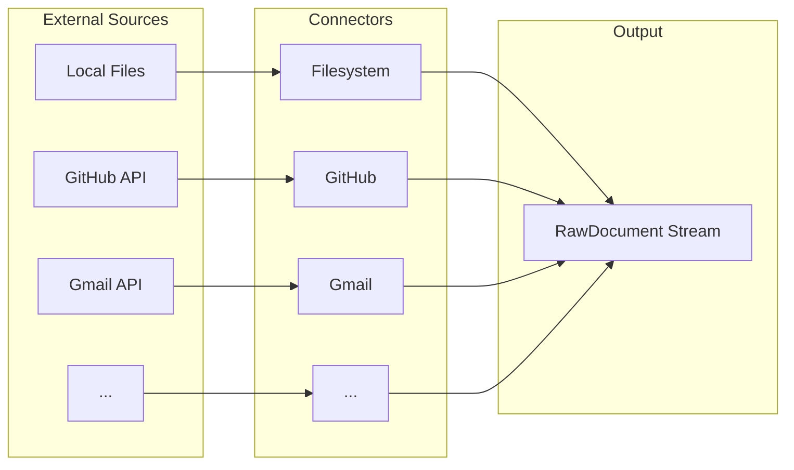
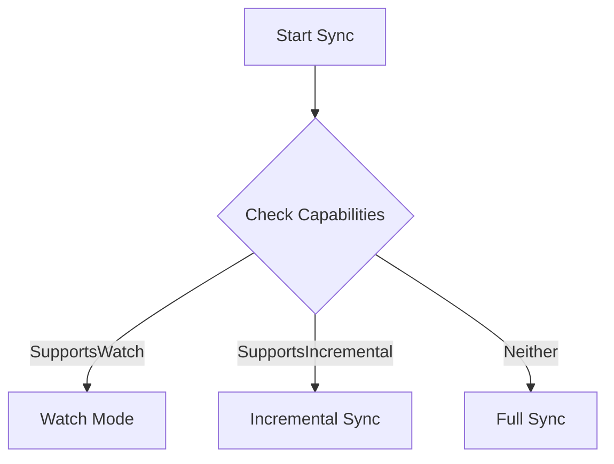
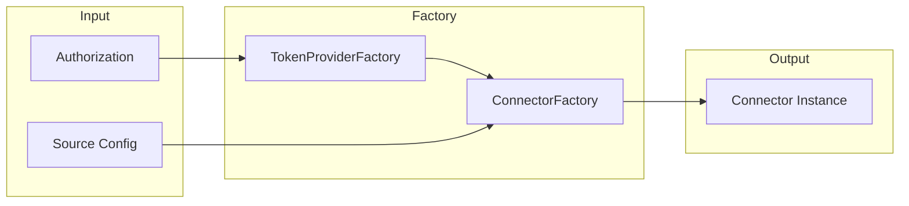
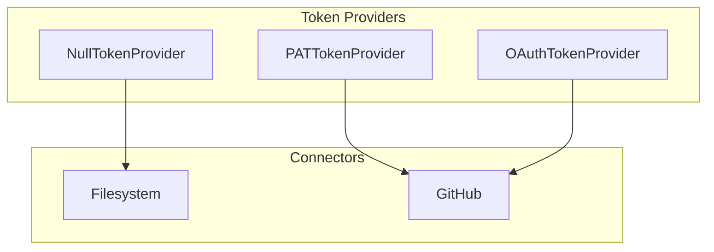
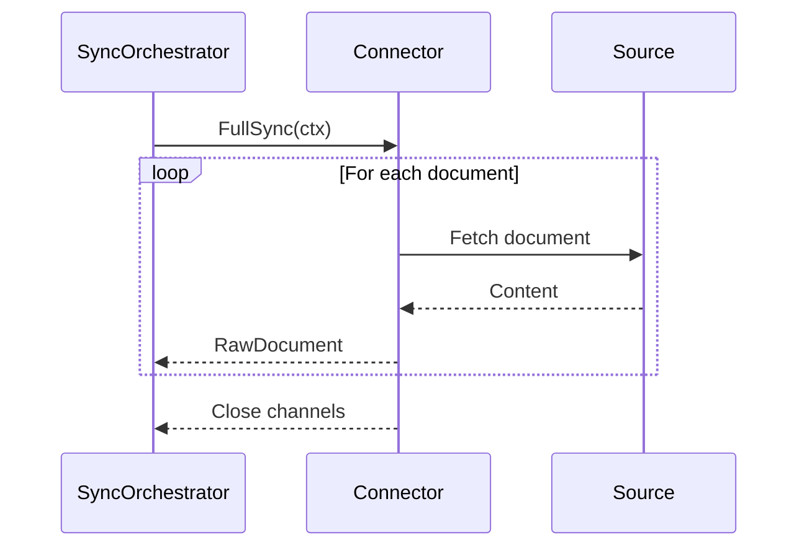
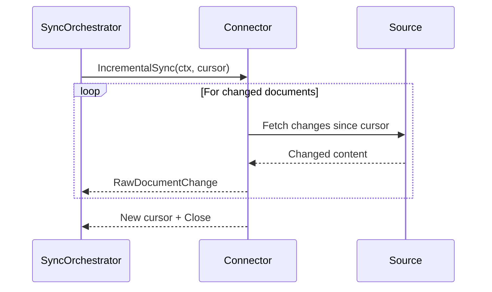
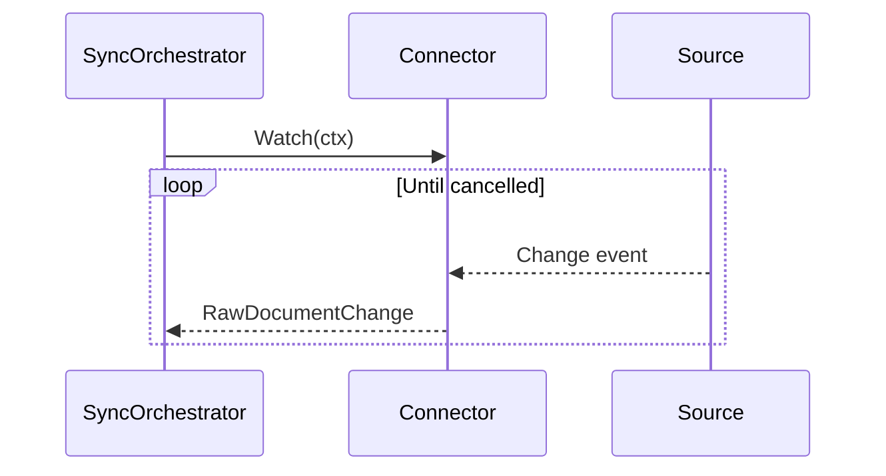

# Connectors Overview

Connectors are the data ingestion layer of Sercha. They fetch content from external sources and produce a uniform stream of raw documents for the sync pipeline.

## What Connectors Do

Each connector handles the specifics of its source (authentication, pagination, rate limiting) and produces a uniform `RawDocument` stream. The rest of the pipeline does not need to know where data originated.

## Core Responsibilities

| Responsibility | Description |
|----------------|-------------|
| Authentication | Handle OAuth, PAT, or other auth methods for the source |
| Data fetching | Retrieve content via APIs, filesystem access, or other protocols |
| Rate limiting | Respect API quotas and avoid service disruption |
| Cursor management | Track sync state for incremental updates |
| Error handling | Gracefully handle network failures and API errors |
| MIME detection | Assign appropriate content types to fetched documents |

## Connector Interface

Every connector implements a common interface that the sync orchestrator understands. The interface defines the contract between connectors and the core system.

### Required Operations

| Operation | Purpose |
|-----------|---------|
| FullSync | Fetch all documents from the source |
| IncrementalSync | Fetch only documents changed since the last sync |
| Watch | Subscribe to real-time change notifications |
| Validate | Verify configuration and connectivity |
| Close | Release resources cleanly |

Not all connectors support all operations. The capability system allows connectors to declare what they support.

## Capability System

Connectors declare their capabilities so the sync orchestrator can choose the optimal sync strategy.

### Capability Flags

| Capability | Description | Example Connectors |
|------------|-------------|-------------------|
| SupportsIncremental | Can fetch only changes since a cursor | GitHub, Gmail |
| SupportsWatch | Can push real-time change events | Filesystem |
| SupportsHierarchy | Documents have parent-child relationships | GitHub (repos/files), Filesystem (directories) |
| SupportsBinary | Can handle binary content | All |
| RequiresAuth | Needs authentication credentials | GitHub, Gmail, Notion |
| SupportsValidation | Can verify configuration before sync | All |
| SupportsCursorReturn | Returns a cursor for incremental sync | GitHub, Filesystem |
| SupportsRateLimiting | Has built-in rate limit handling | GitHub |
| SupportsPagination | Handles paginated API responses internally | GitHub, Gmail |

### Capability-Driven Behaviour

The sync orchestrator automatically adapts based on capabilities:

| Scenario | Orchestrator Behaviour |
|----------|------------------------|
| First sync, no cursor | Always runs FullSync |
| Has cursor, supports incremental | Runs IncrementalSync |
| Supports watch | Can start long-running watch mode |
| Does not support incremental | Runs FullSync every time |

## Connector Factory

The connector factory creates connector instances from source configuration. This decouples the core system from specific connector implementations.

### Factory Responsibilities

| Responsibility | Description |
|----------------|-------------|
| Builder registration | Stores builder functions for each connector type |
| Type dispatch | Creates the correct connector based on source type |
| Token resolution | Resolves authorization IDs to token providers |
| Configuration parsing | Validates and parses source-specific configuration |

### Registration Pattern

Connectors register themselves at application startup. The factory maintains a registry of connector types and their corresponding builder functions.

| Connector Type | Builder Function |
|----------------|------------------|
| filesystem | Creates filesystem connector with path configuration |
| github | Creates GitHub connector with repository patterns and content filters |

New connectors are added by registering a builder function. No changes to core services are required.

## Authentication

Connectors that access external services require authentication. The token provider abstraction handles this uniformly.

### Token Provider Types

| Provider | Use Case | Token Refresh |
|----------|----------|---------------|
| NullTokenProvider | Local sources (filesystem) | Not applicable |
| PATTokenProvider | Personal access tokens | No refresh needed |
| OAuthTokenProvider | OAuth-based services | Automatic refresh before expiry |

### Authentication Flow

1. Source configuration references an authorization ID
2. Factory resolves the authorization ID to a token provider
3. Connector receives the token provider at creation time
4. Connector calls token provider when making authenticated requests
5. Token provider handles refresh transparently

## RawDocument Output

All connectors produce `RawDocument` objects with a common structure.

### RawDocument Fields

| Field | Description |
|-------|-------------|
| SourceID | Identifies which source this document belongs to |
| URI | Unique identifier for the document within the source |
| MIMEType | Content type for normaliser dispatch |
| Content | Raw bytes of the document |
| ParentURI | Optional parent reference for hierarchical sources |
| Metadata | Source-specific metadata (timestamps, authors, etc.) |

### URI Patterns

Each connector defines URI patterns appropriate for its source:

| Connector | URI Pattern | Example |
|-----------|-------------|---------|
| Filesystem | Absolute file path | `/home/user/docs/readme.md` |
| GitHub | `github://{owner}/{repo}/{type}/{path}` | `github://acme/api/file/src/main.go` |

## Sync Strategies

### Full Sync

Full sync retrieves all documents from the source. This is used on first sync or when the connector does not support incremental sync.

### Incremental Sync

Incremental sync uses a cursor to fetch only documents changed since the last sync. This significantly reduces sync time for large sources.

### Watch Mode

Watch mode provides real-time updates by subscribing to change events. Only connectors with local access (like filesystem) support this.

## Change Types

Incremental sync and watch mode report changes with a type indicator:

| Change Type | Description |
|-------------|-------------|
| Created | New document added to source |
| Updated | Existing document modified |
| Deleted | Document removed from source |

## Error Handling

Connectors handle errors gracefully to avoid disrupting the sync process.

### Error Categories

| Category | Handling |
|----------|----------|
| Transient (network timeout) | Retry with backoff |
| Rate limit | Wait and retry |
| Authentication failure | Report and stop |
| Document read failure | Skip document, continue sync |
| Configuration error | Report and stop |

### SyncComplete Signal

When a sync completes successfully, connectors that support cursors send a `SyncComplete` signal containing the new cursor. The sync orchestrator persists this for the next incremental sync.

## Built-in Connectors

Sercha includes the following connectors:

| Connector | Source Type | Authentication |
|-----------|-------------|----------------|
| [Filesystem](./filesystem) | Local files and directories | None required |
| [GitHub](./github) | GitHub repositories (files, issues, PRs, wikis) | OAuth or PAT |

## Adding New Connectors

New connectors can be added without modifying core services. See [Extensibility](../architecture/extensibility) for the process.

The connector interface is designed for stability. Changes to the interface are rare and follow semantic versioning.

## Next

- [Filesystem Connector](./filesystem) - Index local files and directories
- [GitHub Connector](./github) - Index GitHub repositories
- [Architecture: Extensibility](../architecture/extensibility) - Adding new connectors
- [Architecture: Data Flow](../architecture/data-flow) - How data moves through the system
