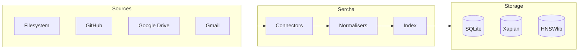

# Overview

Sercha is a **privacy-first local search engine** that indexes your personal data and makes it instantly searchable. All data stays on your machine.

## Why Sercha?

| Feature | Description |
|---------|-------------|
| **Privacy-first** | Your data never leaves your machine |
| **Local-first** | Works offline, no internet required |
| **Extensible** | Plugin system for data sources and file formats |
| **Hybrid search** | Full-text (Xapian) + vector similarity (HNSWlib) |

## How It Works

1. **Connectors** fetch raw data from your sources
2. **Normalisers** transform content into searchable text
3. **Index** stores everything locally for instant search

## Supported Connectors

| Connector | Description | Authentication |
|-----------|-------------|----------------|
| [Filesystem](./connectors/filesystem) | Local files and directories | None |
| [GitHub](./connectors/github) | Repositories, issues, PRs, wikis | PAT or OAuth |
| [Google Drive](./connectors/google/drive) | Documents, spreadsheets, files | OAuth |
| [Gmail](./connectors/google/gmail) | Email messages and threads | OAuth |
| [Google Calendar](./connectors/google/calendar) | Calendar events | OAuth |

See [Supported Connectors](./supported-connectors) for the full list.

## Search Modes

Sercha supports multiple search modes depending on your AI provider configuration:

| Mode | Description | Requirements |
|------|-------------|--------------|
| **Text Only** | Fast keyword search using Xapian | None (default) |
| **Hybrid** | Keyword + semantic vector search | Embedding provider |
| **LLM Assisted** | Query expansion with AI | LLM provider |
| **Full** | All features combined | Both providers |

See [AI Models](./models/overview) for configuration details.

## Interfaces

Sercha provides multiple ways to interact:

| Interface | Description | Status |
|-----------|-------------|--------|
| **CLI** | Command-line for scripting and quick searches | Available |
| **[TUI](./tui/overview)** | Interactive terminal UI with keyboard navigation | Available |
| **[MCP](./mcp/overview)** | Model Context Protocol server for AI tools | Available |

## Architecture

Sercha uses **Hexagonal Architecture** (Ports & Adapters) to enable:

- Adding data sources without changing core code
- Adding file formats without changing core code
- Swapping search backends without affecting connectors
- Parallel development across teams

See the [Architecture Overview](./architecture/overview) for details.

## Next Steps

- [Quickstart](./quickstart) - Get up and running in 5 minutes
- [Basic Configuration](./basic-configuration) - Configure your setup
