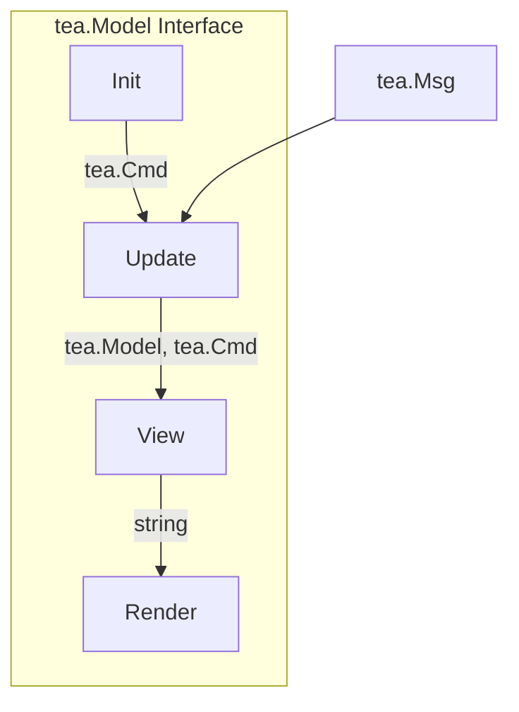
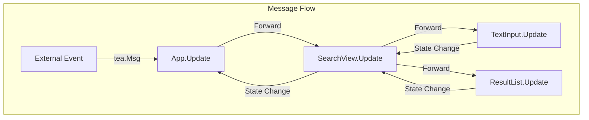
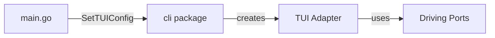

# Terminal UI Architecture

This document covers the technical implementation of the Sercha TUI.

## Framework

The TUI is built with [Bubbletea](https://github.com/charmbracelet/bubbletea), a Go framework for building terminal UIs based on the Elm Architecture.

### Why Bubbletea?

| Feature | Benefit |
|---------|---------|
| **Elm Architecture** | Predictable state management |
| **Composable** | Build complex UIs from simple components |
| **Testable** | Pure functions are easy to test |
| **Go-native** | No CGO, easy cross-compilation |

### Supporting Libraries

| Library | Purpose |
|---------|---------|
| [Bubbles](https://github.com/charmbracelet/bubbles) | Pre-built components (text input, viewport) |
| [Lipgloss](https://github.com/charmbracelet/lipgloss) | Styling and layout |

## Directory Structure

```
internal/adapters/driving/tui/
├── app.go              # Main application (tea.Model)
├── ports.go            # Port aggregation for DI
├── errors.go           # TUI-specific errors
├── views/
│   ├── menu/           # Main menu view
│   │   └── menu.go
│   ├── search/         # Search view
│   │   └── search.go
│   ├── sources/        # Sources list view
│   │   └── sources.go
│   ├── sourcedetail/   # Source detail view
│   │   └── sourcedetail.go
│   ├── documents/      # Documents list view
│   │   └── documents.go
│   ├── doccontent/     # Document content view
│   │   └── doccontent.go
│   └── docdetails/     # Document details view
│       └── docdetails.go
├── components/
│   ├── input/          # Text input component
│   ├── list/           # Result list component
│   └── status/         # Status bar component
├── styles/
│   └── theme.go        # Colors and styling
├── keymap/
│   └── keymap.go       # Keyboard bindings
└── messages/
    └── messages.go     # Message types
```

## Core Concepts

### Model-Update-View

Every Bubbletea component implements `tea.Model`:



| Method | Purpose |
|--------|---------|
| `Init()` | Returns initial command (e.g., start cursor blink) |
| `Update(msg)` | Handles messages, returns new model + commands |
| `View()` | Returns string to render |

### Message Flow

Messages flow through the component hierarchy:



### Custom Messages

The TUI defines custom message types for internal communication:

| Message | Purpose |
|---------|---------|
| `QueryChanged` | Search query was modified |
| `SearchCompleted` | Search finished (with results or error) |
| `ResultSelected` | User selected a result |
| `ViewChanged` | Active view changed |
| `ErrorOccurred` | An error occurred |
| `SourcesLoaded` | Sources list loaded |
| `SourceSelected` | User selected a source |
| `SourceRemoved` | Source was deleted |
| `DocumentsLoaded` | Documents list loaded |
| `DocumentSelected` | User selected a document |
| `DocumentContentLoaded` | Document content fetched |
| `DocumentDetailsLoaded` | Document details fetched |
| `Quit` | User requested quit |

## Component Details

### App (`app.go`)

The root component that:
- Owns all state
- Routes messages to child views
- Manages view transitions
- Coordinates with driving ports

### Search View (`views/search/`)

Composes three components:
- **TextInput**: Query entry field
- **ResultList**: Scrollable results
- **StatusBar**: State and help hints

### Sources View (`views/sources/`)

Displays list of configured sources:
- **Source List**: Scrollable list with type indicators
- **Delete Action**: Remove source with confirmation

### Source Detail View (`views/sourcedetail/`)

Detail panel for a single source:
- **Source Info**: Name, type, ID
- **Document Count**: Number of indexed documents
- **Options Menu**: View docs, sync, delete, back

### Documents View (`views/documents/`)

Lists documents for a source:
- **Document List**: Scrollable with titles
- **Action Menu**: Popup for document actions

### Document Content View (`views/doccontent/`)

Full-text content display:
- **Text Area**: Scrollable content with line wrapping
- **Navigation**: Vim-style scroll keys

### Document Details View (`views/docdetails/`)

Document metadata display:
- **Property List**: Key-value pairs
- **Scrollable**: For long metadata lists

### Components (`components/`)

Reusable UI elements:

| Component | Responsibility |
|-----------|---------------|
| `SearchInput` | Wraps `bubbles/textinput` with styling |
| `ResultList` | Displays and navigates search results |
| `StatusBar` | Shows state, result count, key hints |

### Styles (`styles/`)

Centralized theming using Lipgloss:

| Style | Usage |
|-------|-------|
| `Title` | Headers and labels |
| `Selected` | Highlighted items |
| `Error` | Error messages |
| `Muted` | Secondary text |
| `InputField` | Text input borders |

## Port Integration

The TUI is a **driving adapter** in the hexagonal architecture.

### Ports Struct

The TUI aggregates required ports:

| Port | Interface | Purpose |
|------|-----------|---------|
| `Search` | `driving.SearchService` | Execute searches |
| `Source` | `driving.SourceService` | Manage sources |
| `Sync` | `driving.SyncOrchestrator` | Trigger syncs |
| `Document` | `driving.DocumentService` | Manage documents |

### Dependency Injection

Services are injected via `cli.SetTUIConfig()` before the CLI executes:



### No Direct Service Imports

The TUI only imports:
- `core/ports/driving` (interfaces)
- `core/domain` (entities)

It never imports `core/services` directly, maintaining hexagonal architecture purity.

## Testing

Components are tested using:
- **Unit tests**: Test `Update()` and `View()` in isolation
- **Mock ports**: Inject mock implementations of driving ports
- **Message assertions**: Verify correct messages are produced

Key test files:
- `app_test.go` - App behavior tests
- `ports_test.go` - Mock service definitions
- `views/search/search_test.go` - Search view tests
- `components/*/..._test.go` - Component tests

## Key Source Files

| File | Description |
|------|-------------|
| `internal/adapters/driving/tui/app.go` | Main TUI application |
| `internal/adapters/driving/tui/ports.go` | Port aggregation |
| `internal/adapters/driving/tui/views/menu/menu.go` | Main menu view |
| `internal/adapters/driving/tui/views/search/search.go` | Search view |
| `internal/adapters/driving/tui/views/sources/sources.go` | Sources list |
| `internal/adapters/driving/tui/views/sourcedetail/sourcedetail.go` | Source detail |
| `internal/adapters/driving/tui/views/documents/documents.go` | Documents list |
| `internal/adapters/driving/tui/views/doccontent/doccontent.go` | Document content |
| `internal/adapters/driving/tui/views/docdetails/docdetails.go` | Document details |
| `internal/adapters/driving/tui/styles/theme.go` | Theming |
| `internal/adapters/driving/cli/tui.go` | CLI command integration |
