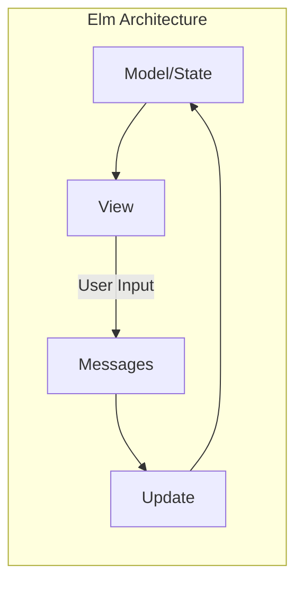
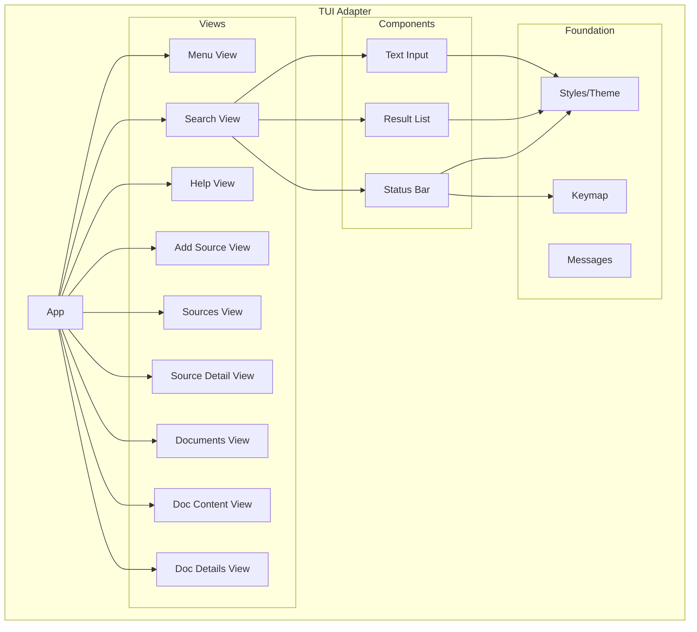
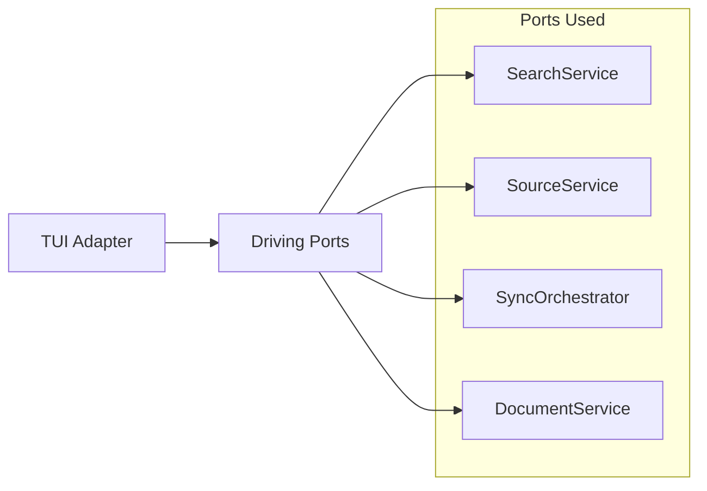

# Terminal UI Overview

The TUI (Terminal User Interface) provides an interactive, visual interface for searching your indexed documents directly in the terminal.

## Purpose

While the CLI is great for scripting and quick searches, the TUI offers:

| Feature | Benefit |
|---------|---------|
| **Visual feedback** | See results as you type |
| **Keyboard navigation** | Browse results without leaving the terminal |
| **Persistent session** | Search multiple queries without restarting |
| **Rich formatting** | Styled output with colors and layout |

## Architecture Pattern

The TUI follows the **Elm Architecture** (Model-Update-View), which provides:

- **Predictable state management** - All state changes flow through `Update()`
- **Testable components** - Pure functions for rendering
- **Unidirectional data flow** - Messages trigger updates, updates trigger views

## Component Hierarchy

The TUI is organized into layers:

| Layer | Purpose |
|-------|---------|
| **App** | Main entry point, routes messages, manages views |
| **Views** | Compose components into screens |
| **Components** | Reusable UI elements (input, list, status) |
| **Foundation** | Styles, keymaps, message types |

## Integration with Hexagonal Architecture

The TUI is a **driving adapter** that calls into the core via driving ports:

The TUI never imports core services directly—it only depends on port interfaces, maintaining architectural purity.

## Next

- [Usage Guide](./usage) - How to use the TUI
- [Architecture](./architecture) - Technical deep dive
