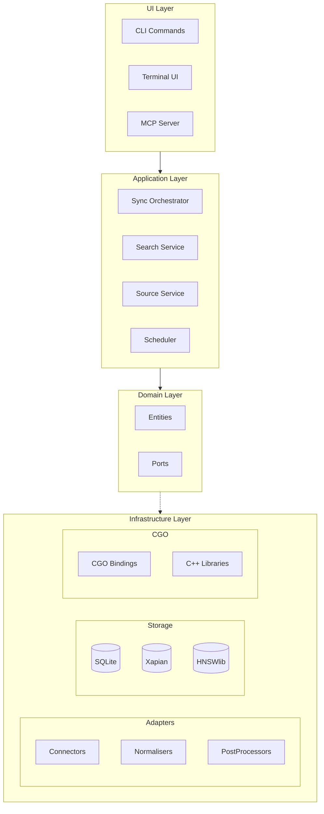
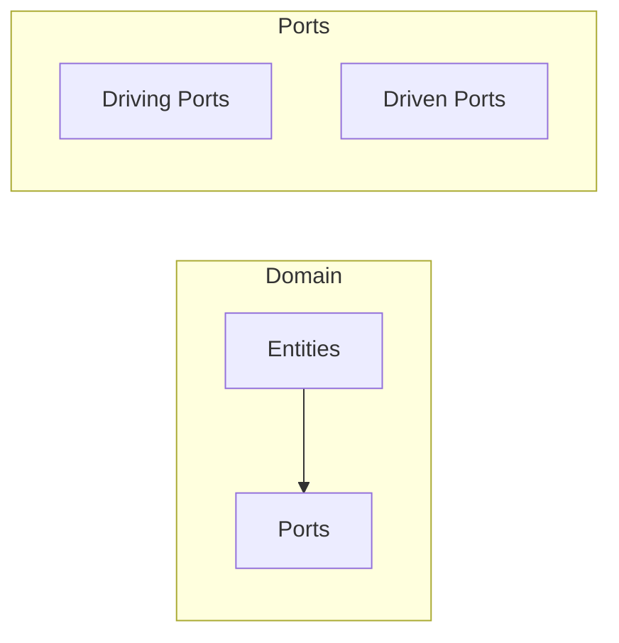
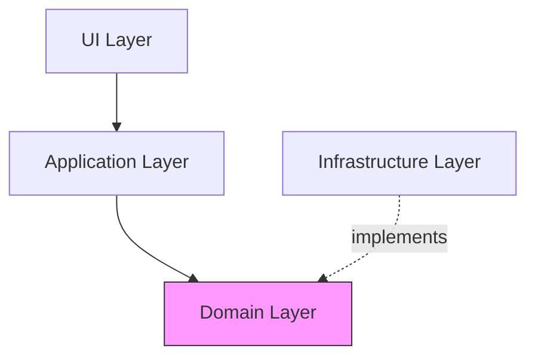

# System Layers

Sercha is organized into distinct layers, each with clear responsibilities and dependencies.

## Layer Diagram



## Layer Responsibilities

### UI Layer (Driving Adapters)

| Component | Purpose |
|-----------|---------|
| CLI | Command-line interface for users |
| TUI | Interactive terminal interface |
| MCP | Model Context Protocol server for AI tools |

**Rule:** UI adapters only call driving ports. They never access infrastructure directly.

### Application Layer (Services)

| Service | Responsibility |
|---------|----------------|
| Sync Orchestrator | Coordinates sync execution across sources |
| Search Service | Executes queries, combines results |
| Source Service | CRUD operations for data sources |
| Scheduler | Background task execution (token refresh, document sync) |

**Rule:** Services orchestrate domain logic. They don't know about specific connectors or storage.

### Domain Layer (Core)



| Component | Purpose |
|-----------|---------|
| Entities | Document, Chunk, Source, RawDocument |
| Driving Ports | Interfaces for UI to call |
| Driven Ports | Interfaces for infrastructure |

**Rule:** Domain has ZERO external dependencies. Pure business logic.

### Infrastructure Layer (Driven Adapters)

| Category | Components | Required? |
|----------|------------|-----------|
| Connectors | Filesystem, Gmail, GitHub | At least one |
| Normalisers | PDF, Markdown, HTML | At least one |
| PostProcessors | Chunker, Embedder, Summariser | No (optional pipeline stages) |
| Storage | SQLite, Xapian | **Yes** (core functionality) |
| Storage | HNSWlib | No (only when embeddings configured) |
| CGO | Bindings | Yes (for Xapian/HNSWlib) |

**Rule:** Infrastructure implements driven port interfaces.

## Dependency Direction



Dependencies point **inward** toward the domain. Infrastructure depends on domain, not vice versa.

## Directory Mapping

```
internal/
├── adapters/
│   ├── driving/          # UI Layer
│   │   ├── cli/
│   │   ├── tui/
│   │   └── mcp/
│   └── driven/           # Infrastructure (Storage)
│       ├── sqlite/
│       ├── xapian/
│       └── hnsw/
├── core/
│   ├── domain/           # Domain Layer (Entities)
│   ├── ports/
│   │   ├── driving/      # Domain Layer (Driving Ports)
│   │   └── driven/       # Domain Layer (Driven Ports)
│   └── services/         # Application Layer (incl. Scheduler)
├── connectors/           # Infrastructure (Connectors)
├── normalisers/          # Infrastructure (Normalisers)
├── postprocessors/       # Infrastructure (PostProcessors)
cgo/                      # CGO Bindings
clib/                     # C++ Libraries
```

## Dependency Matrix

This matrix defines what each layer may import. Violations break architectural purity.

| Layer | Can Import | Cannot Import |
|-------|------------|---------------|
| **Connectors** | HTTP libs, OAuth libs, `core/domain`, `core/ports/driven` | `core/services`, other connectors |
| **Normalisers** | Parsing libs, `core/domain`, `core/ports/driven` | `core/services`, connectors |
| **PostProcessors** | LLM libs, `core/domain`, `core/ports/driven` | `core/services`, connectors |
| **Services** | `core/domain`, `core/ports/*` | Connectors, normalisers, adapters |
| **Domain** | Standard library only | Everything else |
| **Driving Adapters** | `core/ports/driving` | `core/services` directly |

:::warning
New contributors often break purity by importing connectors into services. This couples core to infrastructure. Use the factory pattern instead.
:::

## Next

- [Data Flow](./data-flow) - How data moves through layers
- [Storage Layer](./storage-layer) - Deep dive into storage
