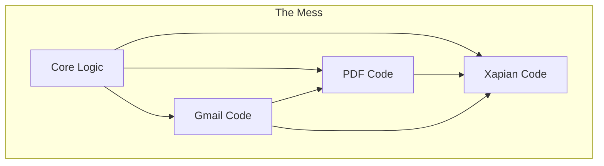
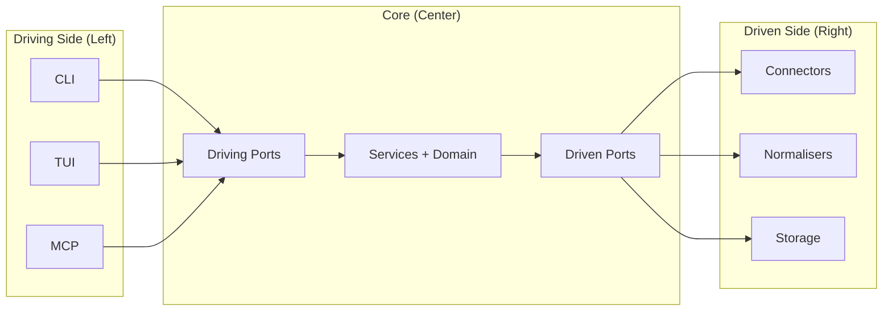
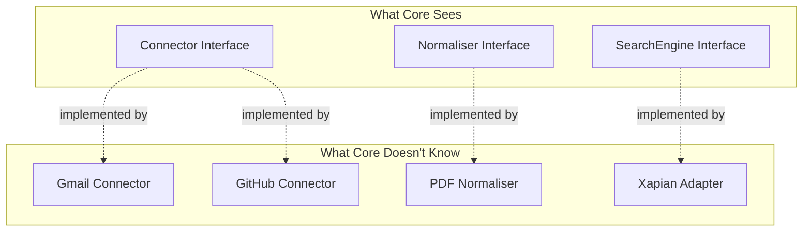

# Architecture Overview

Sercha uses **Hexagonal Architecture** (Ports & Adapters) to achieve maximum extensibility with minimum coupling.

## The Problem

Sercha needs to support many moving parts:

| Requirement | Examples |
|-------------|----------|
| Multiple data sources | Gmail, Slack, GitHub, Filesystem, Notion |
| Multiple file formats | PDF, Markdown, HTML, DOCX, emails, code |
| Multiple search backends | Full-text (Xapian), Vector (HNSWlib) |
| Multiple UIs | CLI, TUI, MCP server |

Without careful architecture, this becomes tangled:

Every component knows about every other. Changes ripple everywhere.

## The Solution

**Driving ports** (left): Interfaces that UI adapters call INTO the core

**Driven ports** (right): Interfaces that core calls OUT to infrastructure

**Core knows nothing about the outside world.** It only knows abstract interfaces.

## Key Insight

The core never imports concrete implementations:

Adding Gmail support requires **zero changes to core code**.

## The Rule: Dependencies Flow Inward

Adapters depend on ports. Ports depend on core. **Core depends on nothing external.**

:::info Core Purity
The `core/` package is pure Go—no CGO, no network calls, no file I/O. All external interactions happen through driven adapters.
:::

## Required vs Optional Services

Not all driven adapters are required. Sercha degrades gracefully when optional services are unavailable:

| Service | Required? | Without It |
|---------|-----------|------------|
| SQLite (metadata) | **Yes** | Cannot function |
| Xapian (full-text) | **Yes** | Cannot search |
| HNSWlib (vectors) | No | No semantic search |
| Embedding Service | No | No vector generation |
| LLM Service | No | No query rewriting |

This allows Sercha to work on systems without AI services configured—pure keyword search is always available.

## Benefits

| Benefit | How |
|---------|-----|
| **Plugin-like extensibility** | New connector = new package + one registration line |
| **Parallel development** | Teams work on isolated packages, no merge conflicts |
| **Testability** | Core services tested with mock adapters |
| **Technology independence** | Swap Xapian for Elasticsearch without touching business logic |
| **Bug isolation** | Gmail bug cannot break GitHub connector |

## Trade-offs

| Benefit | Cost |
|---------|------|
| Flexibility | More interfaces to define upfront |
| Testability | Indirection adds complexity |
| Independence | Learning curve for contributors |

For Sercha's requirements (many integrations, open-source contributors, long-term maintenance), the benefits far outweigh the costs.

## Why Not Other Patterns?

| Pattern | When to Use | Why Not for Sercha |
|---------|-------------|-------------------|
| **Layered** | Simple CRUD apps | Too rigid for plugin system |
| **Microservices** | Distributed teams | Overkill for single binary |
| **Hexagonal** | Many integrations | Perfect fit |

## Next

- [System Layers](./layers) - How the layers are organized
- [Data Flow](./data-flow) - How data moves through the system
