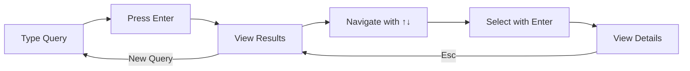
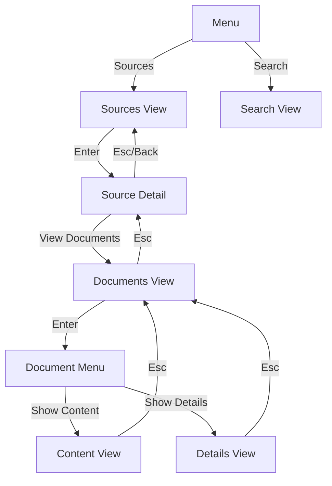
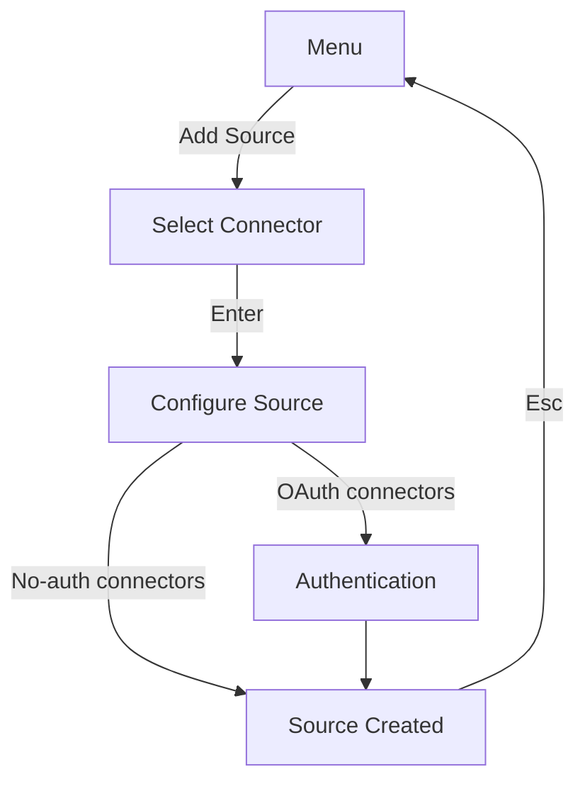

# Terminal UI Usage Guide

This guide covers how to launch and navigate the Sercha TUI.

## Launching the TUI

```bash
sercha tui
```

## Keyboard Shortcuts

### Navigation

| Key | Action |
|-----|--------|
| `↑` or `k` | Move selection up |
| `↓` or `j` | Move selection down |
| `Enter` | Execute search / Select item |
| `Esc` | Go back / Cancel |

### Global

| Key | Action |
|-----|--------|
| `?` | Toggle help view |
| `q` | Quit TUI |
| `Ctrl+C` | Force quit |

### Sources & Documents

| Key | Action |
|-----|--------|
| `d` | Delete source (Sources View) |
| `r` | Reload sources list |
| `o` | Open document in external app |
| `PgUp` | Page scroll up (content views) |
| `PgDn` | Page scroll down (content views) |

## Search Workflow

1. **Type your query** in the search input
2. **Press Enter** to execute the search
3. **Navigate results** using arrow keys or `j`/`k`
4. **Select a result** with Enter to view details



## Sources & Documents Workflow

Navigate the source hierarchy to manage and browse documents:



## Add Source Workflow

The Add Source wizard guides you through configuring a new data source:



### Steps

1. **Select Connector** - Choose from available connector types (Filesystem, GitHub, Google Drive, etc.)
2. **Configure** - Enter connector-specific settings (path, owner/repo, folder ID, etc.)
3. **Authenticate** (if required) - Complete OAuth flow or enter credentials
4. **Done** - Source is created and ready for sync

### Keyboard Shortcuts

| Key | Action |
|-----|--------|
| `↑` or `k` | Move selection up |
| `↓` or `j` | Move selection down |
| `Enter` | Select / Continue |
| `Esc` | Cancel / Go back |
| `Tab` | Next input field |
| `Shift+Tab` | Previous input field |

## Views

### Search View (Default)

The main view where you enter queries and browse results.

| Element | Description |
|---------|-------------|
| **Title** | "Sercha" header |
| **Search Input** | Text field for entering queries |
| **Results List** | Scrollable list of matching documents |
| **Status Bar** | Shows state (ready, searching, error) and result count |

### Help View

Press `?` to see keyboard shortcuts and usage hints.

### Menu View

Main navigation hub accessible from startup or by pressing `Esc` from other views.

| Option | Description |
|--------|-------------|
| **Search** | Navigate to search view |
| **Sources** | Browse configured sources |
| **Add Source** | Add a new data source |
| **Settings** | Configure search modes and AI providers |
| **Help** | View keyboard shortcuts |
| **Quit** | Exit the TUI |

### Sources View

Browse and manage configured data sources.

| Element | Description |
|---------|-------------|
| **Source List** | All configured sources with type indicators |
| **Actions** | `Enter` for details, `d` to delete, `r` to reload |

### Source Detail View

Detailed view for a single source with available actions.

| Option | Description |
|--------|-------------|
| **View Documents** | Browse documents from this source |
| **Sync Now** | Trigger synchronization |
| **Delete Source** | Remove source and its documents |
| **Back** | Return to sources list |

### Documents View

Browse documents belonging to a source.

| Element | Description |
|---------|-------------|
| **Document List** | Documents with titles and metadata |
| **Action Menu** | Press `Enter` to open action menu |

**Action Menu Options:**
- **Show Content** - View document text
- **Show Details** - View document metadata
- **Open Document** - Open in external app
- **Refresh** - Re-sync document
- **Exclude** - Remove from index

### Document Content View

Full-text view of document content.

| Key | Action |
|-----|--------|
| `↑` or `k` | Scroll up |
| `↓` or `j` | Scroll down |
| `PgUp` | Page up |
| `PgDn` | Page down |
| `Esc` | Back to documents |

### Document Details View

Metadata view for a document.

| Field | Description |
|-------|-------------|
| **Title** | Document name |
| **Source** | Parent source name and type |
| **URI** | File path or URL |
| **Chunks** | Number of indexed chunks |
| **Timestamps** | Created/updated dates |
| **Metadata** | Additional properties |

### Settings View

Configure search settings and AI providers within the TUI.

**Overview Screen:**

| Option | Description |
|--------|-------------|
| **Search Mode** | Select text_only, hybrid, llm_assisted, or full |
| **Embedding Provider** | Configure Ollama or OpenAI for semantic search |
| **LLM Provider** | Configure Ollama, OpenAI, or Anthropic for query expansion |

The overview screen displays current settings with configuration status indicators:
- `[configured]` - Provider is ready to use
- `[needs API key]` - Cloud provider requires API key

**Keyboard Shortcuts:**

| Key | Action |
|-----|--------|
| `↑` or `k` | Move selection up |
| `↓` or `j` | Move selection down |
| `Enter` | Edit selected setting |
| `Tab` | Focus API key input (when configuring providers) |
| `Esc` | Go back to menu |

**Provider Configuration:**

When selecting a cloud provider (OpenAI, Anthropic), you'll be prompted to enter an API key. The key is masked during entry for security.

| Provider | Type | API Key Required |
|----------|------|------------------|
| Ollama | Local | No |
| OpenAI | Cloud | Yes |
| Anthropic | Cloud | Yes (LLM only) |

**Search Modes:**

| Mode | Description | Requirements |
|------|-------------|--------------|
| Text Only | Keyword search only (fastest) | None |
| Hybrid | Text + semantic vector search | Embedding provider |
| LLM Assisted | Text + LLM query expansion | LLM provider |
| Full | Text + semantic + LLM | Both providers |

## Troubleshooting

### TUI doesn't fill terminal

Ensure your terminal supports alternate screen mode. Most modern terminals (iTerm2, Terminal.app, Alacritty, kitty) support this.

### Colors look wrong

The TUI uses true color (24-bit). If colors appear wrong:
- Ensure `TERM` is set correctly (e.g., `xterm-256color`)
- Try a terminal with true color support

## Next

- [Architecture](./architecture) - Technical details of TUI implementation
