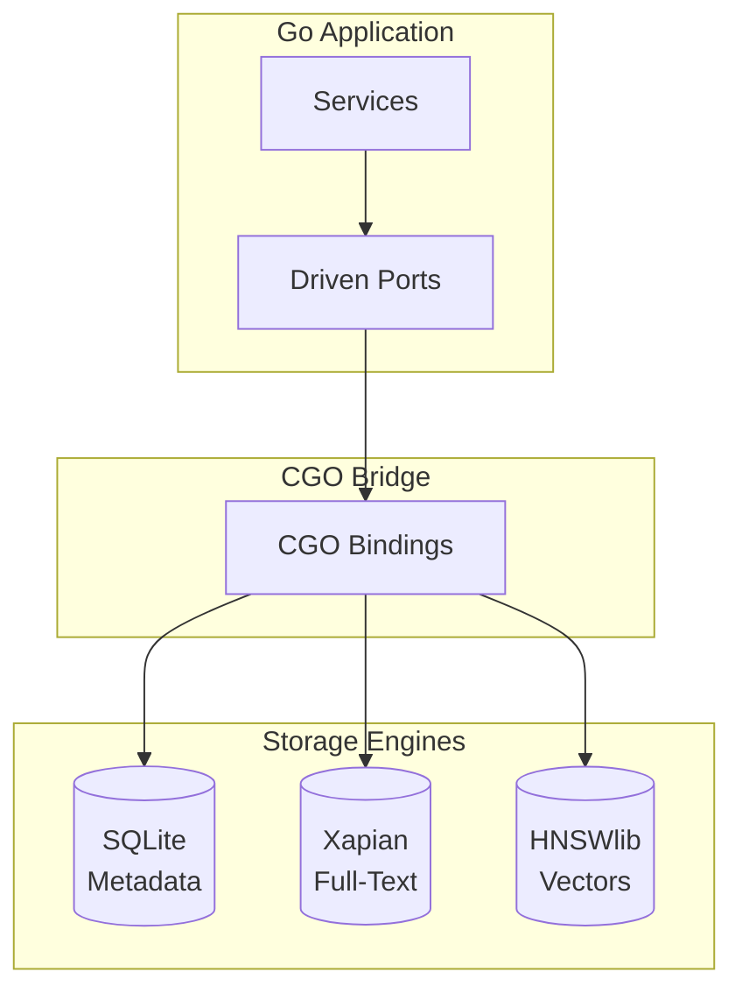
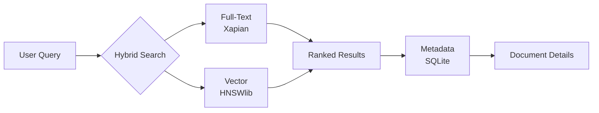
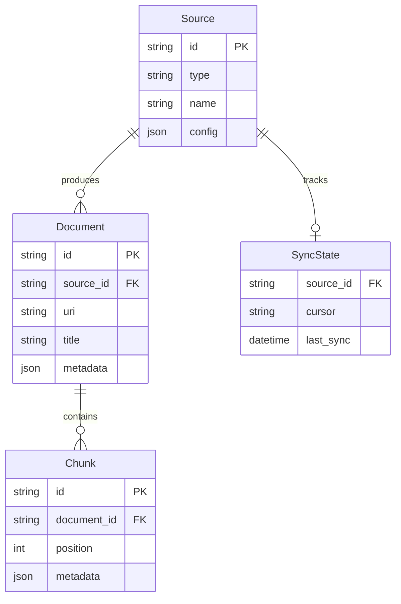
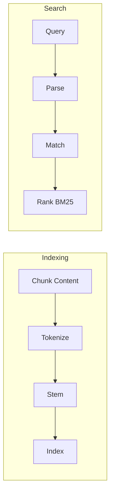
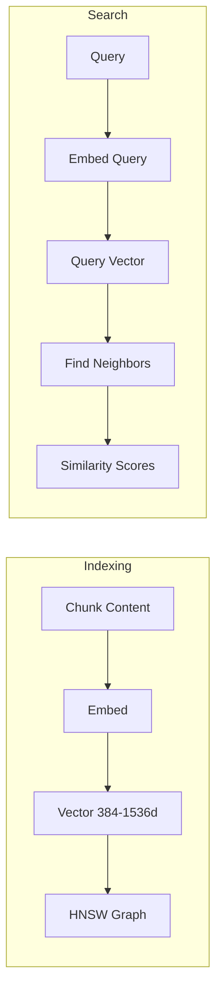
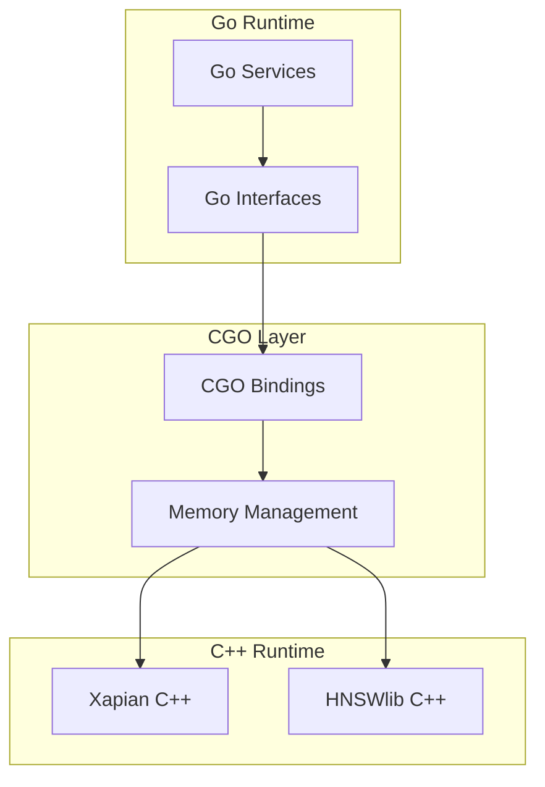
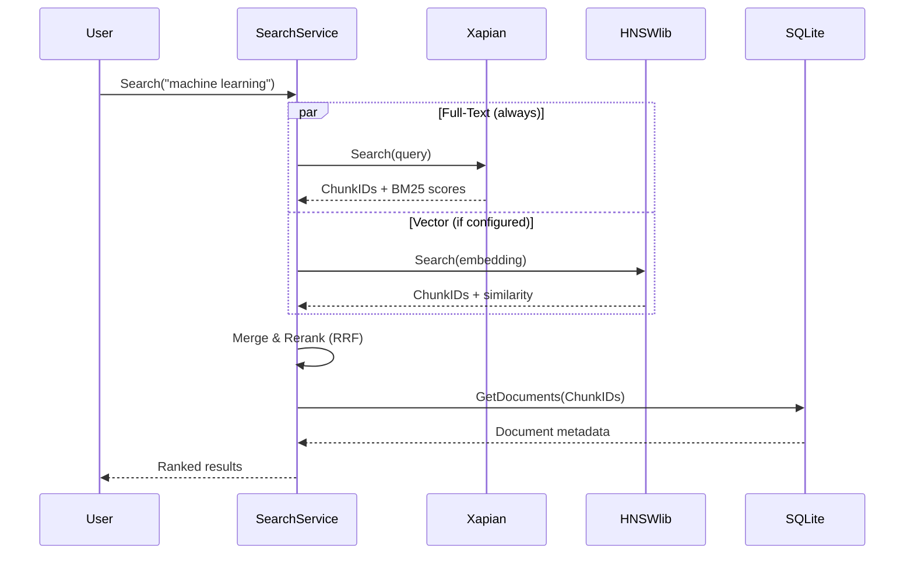
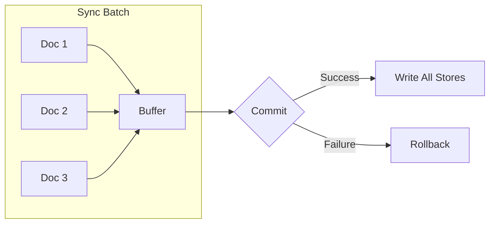

# Storage Layer

Sercha uses a hybrid storage architecture with three specialized stores, connected via CGO.

:::info Local-First
Sercha is **local-first**—no server calls, no telemetry, no cloud dependencies. All data lives on your machine and never leaves it. This is a core architectural guarantee.
:::

## Storage Architecture



## Store Responsibilities

| Store | Technology | Purpose | Required? |
|-------|------------|---------|-----------|
| **Metadata Store** | SQLite | Structured data (sources, docs, chunks) | **Yes** |
| **Full-Text Index** | Xapian | Keyword search (BM25 ranking) | **Yes** |
| **Vector Index** | HNSWlib | Semantic search (embeddings) | No - only when embedding service configured |

:::info Required vs Optional
- **SQLite and Xapian are always required** - they provide core functionality
- **HNSWlib is optional** - only created when an embedding service is configured. Without embeddings, Sercha uses pure keyword search.
:::

## Why Multiple Stores?

Each store is optimised for its specific purpose:

| Concern | Single Store | Specialised Stores |
|---------|--------------|-------------------|
| Keyword search | Slow scans | Xapian BM25 |
| Semantic search | Not possible | HNSWlib ANN (when configured) |
| Metadata queries | OK | SQLite optimised |
| Disk usage | Duplicated | Specialised per concern |

## Graceful Degradation

When embedding services are not configured, Sercha works with just SQLite + Xapian:


When embeddings **are** configured, hybrid search combines both:



## SQLite: Metadata Store

**Stores:**
- Source configurations
- Document metadata (title, URI, timestamps)
- Chunk references
- Sync state (cursors, last sync time)

**Schema Overview:**



## Xapian: Full-Text Index

**Purpose:** Fast keyword search with relevance ranking

**Features:**
- BM25 ranking algorithm
- Stemming (search "running" finds "run")
- Boolean operators (AND, OR, NOT)
- Phrase matching
- Prefix search



## HNSWlib: Vector Index (Optional)

**Purpose:** Semantic similarity search via embeddings

:::note
This store is only created when an embedding service is configured. Without it, Sercha uses pure keyword search via Xapian.
:::

**Features:**
- Approximate Nearest Neighbor (ANN)
- Cosine similarity
- Sub-linear search time
- Memory-mapped for large indexes



## CGO Integration



**CGO Considerations:**

| Aspect | Approach |
|--------|----------|
| Memory | Explicit allocation/deallocation |
| Threading | Go routines ↔ C++ thread safety |
| Errors | C++ exceptions → Go errors |
| Build | Requires C++ toolchain |

## Search Flow

When embeddings are configured, hybrid search uses both stores in parallel:



Without embeddings, only the Xapian path is used (pure keyword search).

## Data Locality

All stores live in one directory:

```
~/.sercha/
├── data/
│   ├── metadata.db      # SQLite (always present)
│   ├── xapian/          # Xapian index (always present)
│   │   └── ...
│   └── vectors/         # HNSWlib index (only when embeddings configured)
│       └── ...
└── config.toml          # Application configuration
```

**Benefits:**
- Single backup location
- Portable across machines
- No network dependencies

## Atomic Indexing

Indexing operations are atomic to prevent partial updates:



| Phase | Action |
|-------|--------|
| **Buffer** | Documents accumulated in memory |
| **Commit** | All stores updated together |
| **Rollback** | On failure, no partial writes |

This ensures the index never contains half-synced data from a crashed operation.

## Next

- [Data Flow](./data-flow) - How data moves through storage
- [Extensibility](./extensibility) - Adding new storage backends
