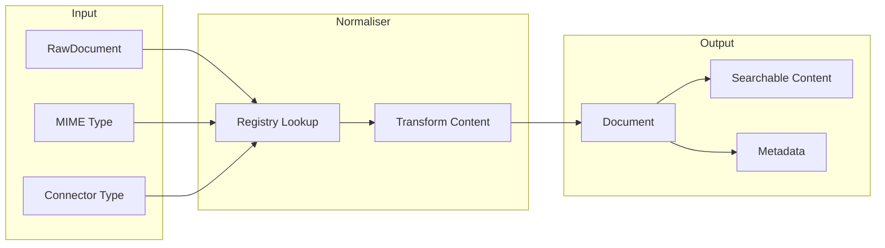
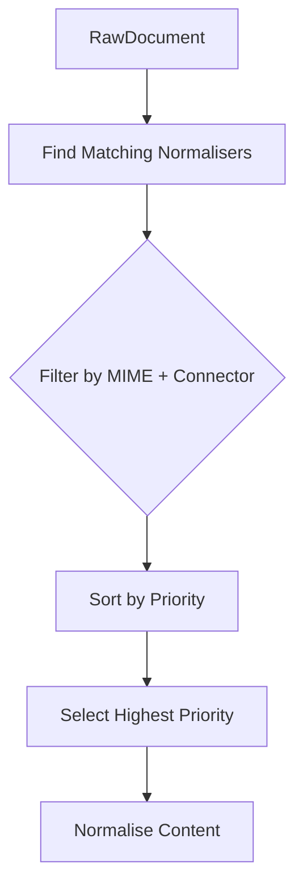

# Normalisers

Normalisers are the content transformation layer of Sercha. They convert raw bytes from connectors into structured documents ready for embedding and search.

## What Normalisers Do

When a connector produces a raw document, the normaliser registry selects the appropriate normaliser based on MIME type and connector type. The normaliser then extracts text content and metadata, producing a document suitable for the embedding pipeline.

## Core Responsibilities

| Responsibility | Description |
|----------------|-------------|
| Content extraction | Extract readable text from various file formats |
| Metadata preservation | Retain useful metadata from the original content |
| Format handling | Parse format-specific structures (PDF pages, HTML elements, Markdown sections) |
| Text cleaning | Remove formatting artifacts and non-searchable content |

## Normaliser Registry

The normaliser registry maintains all registered normalisers and dispatches documents to the appropriate handler. Selection follows a priority-based system that allows specialised normalisers to take precedence over generic ones.

### Selection Process

When a document arrives, the registry:

1. Filters normalisers that support the document's MIME type
2. Further filters by connector type if applicable
3. Sorts remaining candidates by priority (highest first)
4. Selects the highest priority normaliser
5. Invokes normalisation

### Priority System

Normalisers declare a priority value that determines selection order when multiple normalisers match a document. Higher values indicate higher priority.

| Priority Range | Purpose | Examples |
|----------------|---------|----------|
| 90-100 | Connector-specific normalisers | GitHub issues, GitHub pull requests |
| 50-89 | Format-specific normalisers | Markdown, HTML, PDF |
| 1-9 | Fallback normalisers | Plain text catchall |

This system ensures that a GitHub issue (with its custom MIME type) is handled by the GitHub-specific normaliser rather than a generic JSON parser, whilst allowing plain text to act as a universal fallback.

### Connector-Specific Normalisers

Some normalisers are designed for content from specific connectors. These normalisers declare which connector types they support, allowing them to handle custom content formats that only appear from certain sources.

| Normaliser | Connector | MIME Type | Purpose |
|------------|-----------|-----------|---------|
| GitHub Issue | GitHub | `application/vnd.github.issue+json` | Formats issue threads with comments |
| GitHub Pull Request | GitHub | `application/vnd.github.pull+json` | Formats PR threads with review comments |

Connector-specific normalisers receive the highest priority, ensuring they always handle their specialised content types.

## Built-in Normalisers

Sercha includes normalisers for common document formats:

| Format | MIME Types | Priority | Description |
|--------|------------|----------|-------------|
| PDF | `application/pdf` | 70 | Extracts text from PDF documents |
| Markdown | `text/markdown` | 50 | Preserves structure whilst extracting content |
| HTML | `text/html` | 50 | Strips tags, extracts text content |
| Email | `message/rfc822` | 50 | Parses email headers and body |
| Calendar | `text/calendar` | 50 | Extracts event details from ICS files |
| Office Documents | `application/vnd.openxmlformats-*` | 50 | Extracts text from DOCX and similar formats |
| Plain Text | `text/*` | 5 | Fallback for any text content |

### Plain Text Fallback

The plain text normaliser acts as a universal fallback for text content. It matches a broad range of MIME types and has the lowest priority, ensuring it only handles documents when no specialised normaliser is available.

Supported fallback types include:

- Programming languages (`text/x-go`, `text/x-python`, `text/typescript`, etc.)
- Configuration files (`text/yaml`, `text/toml`, `application/json`)
- General text (`text/plain`)

## Normalisation Output

Each normaliser produces a result containing:

| Field | Description |
|-------|-------------|
| Content | Extracted text ready for embedding |
| Metadata | Preserved metadata from the original document |
| Title | Document title if available |

The output document retains the original URI, source ID, and other identifying information from the raw document. Only the content and metadata are transformed.

## Processing Pipeline

Normalisation is one stage in the broader sync pipeline:

After normalisation, documents proceed through chunking (splitting large documents into smaller pieces) and embedding (converting text to vectors) before being stored for search.

## Error Handling

| Error Type | Handling |
|------------|----------|
| No matching normaliser | Falls back to plain text if text MIME type |
| Parse error | Returns error, document skipped |
| Empty content | Document stored with empty content |
| Encoding error | Attempts UTF-8 conversion |

Documents that fail normalisation are logged and skipped. The sync continues with remaining documents.

## Limitations

| Limitation | Description |
|------------|-------------|
| Binary content | Images, audio, and video are not processed |
| Encrypted files | Password-protected documents cannot be normalised |
| Very large files | Memory constraints apply to PDF and Office documents |
| Complex layouts | Multi-column PDFs may have extraction issues |

## Next

- [Connectors Overview](./connectors/overview) - How connectors fetch raw content
- [Architecture: Data Flow](./architecture/data-flow) - How data moves through the system
